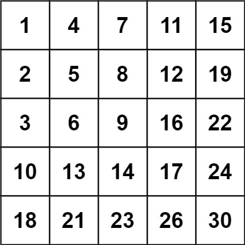
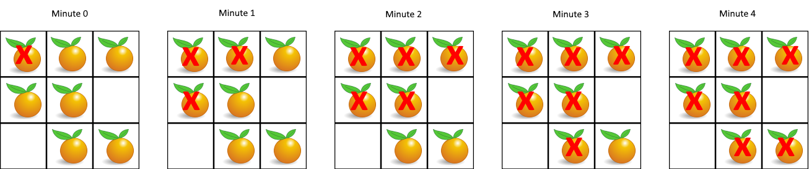
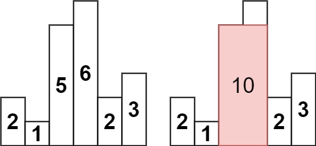
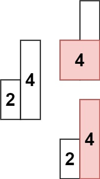

# go-algorithm

## 滑动窗口
438. 找到字符串中所有字母异位词

给定两个字符串 s 和 p，找到 s 中所有 p 的 异位词 的子串，返回这些子串的起始索引。不考虑答案输出的顺序。

异位词 指由相同字母重排列形成的字符串（包括相同的字符串）。

示例 1:

    输入: s = "cbaebabacd", p = "abc"
    输出: [0,6]
    解释:
    起始索引等于 0 的子串是 "cba", 它是 "abc" 的异位词。
    起始索引等于 6 的子串是 "bac", 它是 "abc" 的异位词。

示例 2:

    输入: s = "abab", p = "ab"
    输出: [0,1,2]
    解释:
    起始索引等于 0 的子串是 "ab", 它是 "ab" 的异位词。
    起始索引等于 1 的子串是 "ba", 它是 "ab" 的异位词。
    起始索引等于 2 的子串是 "ab", 它是 "ab" 的异位词。

## 子串
560. 和为 K 的子数组

给你一个整数数组 nums 和一个整数 k ，请你统计并返回 该数组中和为 k 的子数组的个数 。

子数组是数组中元素的连续非空序列。

示例 1：

    输入：nums = [1,1,1], k = 2
    输出：2

示例 2：

    输入：nums = [1,2,3], k = 3
    输出：2

239. 滑动窗口最大值

给你一个整数数组 nums，有一个大小为 k 的滑动窗口从数组的最左侧移动到数组的最右侧。你只可以看到在滑动窗口内的 k 个数字。滑动窗口每次只向右移动一位。

返回 滑动窗口中的最大值 。

示例 1：

    输入：nums = [1,3,-1,-3,5,3,6,7], k = 3
    输出：[3,3,5,5,6,7]
    解释：
    滑动窗口的位置                最大值
    ---------------               -----
    [1  3  -1] -3  5  3  6  7       3
     1 [3  -1  -3] 5  3  6  7       3
     1  3 [-1  -3  5] 3  6  7       5
     1  3  -1 [-3  5  3] 6  7       5
     1  3  -1  -3 [5  3  6] 7       6
     1  3  -1  -3  5 [3  6  7]      7

示例 2：

    输入：nums = [1], k = 1
    输出：[1]

## 普通数组
41. 缺失的第一个正数

给你一个未排序的整数数组 nums ，请你找出其中没有出现的最小的正整数。

请你实现时间复杂度为 O(n) 并且只使用常数级别额外空间的解决方案。

示例 1：

    输入：nums = [1,2,0]
    输出：3
    解释：范围 [1,2] 中的数字都在数组中。

示例 2：

    输入：nums = [3,4,-1,1]
    输出：2
    解释：1 在数组中，但 2 没有。

示例 3：

    输入：nums = [7,8,9,11,12]
    输出：1
    解释：最小的正数 1 没有出现。

## 矩阵
240. 搜索二维矩阵 II

编写一个高效的算法来搜索 m x n 矩阵 matrix 中的一个目标值 target 。该矩阵具有以下特性：

- 每行的元素从左到右升序排列。
- 每列的元素从上到下升序排列。

示例 1：

    输入：matrix = [[1,4,7,11,15],[2,5,8,12,19],[3,6,9,16,22],[10,13,14,17,24],[18,21,23,26,30]], target = 5
    输出：true

示例 2：

    输入：matrix = [[1,4,7,11,15],[2,5,8,12,19],[3,6,9,16,22],[10,13,14,17,24],[18,21,23,26,30]], target = 20
    输出：false

24. 两两交换链表中的节点

给你一个链表，两两交换其中相邻的节点，并返回交换后链表的头节点。你必须在不修改节点内部的值的情况下完成本题（即，只能进行节点交换）。

示例 1：

    输入：head = [1,2,3,4]
    输出：[2,1,4,3]

示例 2：

    输入：head = []
    输出：[]

示例 3：

    输入：head = [1]
    输出：[1]

## 二叉树
437. 路径总和 III

给定一个二叉树的根节点 root ，和一个整数 targetSum ，求该二叉树里节点值之和等于 targetSum 的 路径 的数目。

路径 不需要从根节点开始，也不需要在叶子节点结束，但是路径方向必须是向下的（只能从父节点到子节点）。

示例 1：

    输入：root = [10,5,-3,3,2,null,11,3,-2,null,1], targetSum = 8
    输出：3
    解释：和等于 8 的路径有 3 条，如图所示。

示例 2：

    输入：root = [5,4,8,11,null,13,4,7,2,null,null,5,1], targetSum = 22
    输出：3

## 图论
994. 腐烂的橘子

在给定的 m x n 网格 grid 中，每个单元格可以有以下三个值之一：

- 值 0 代表空单元格；
- 值 1 代表新鲜橘子；
- 值 2 代表腐烂的橘子。

每分钟，腐烂的橘子 周围 4 个方向上相邻 的新鲜橘子都会腐烂。

返回 直到单元格中没有新鲜橘子为止所必须经过的最小分钟数。如果不可能，返回 -1 。

示例 1：

    输入：grid = [[2,1,1],[1,1,0],[0,1,1]]
    输出：4

示例 2：

    输入：grid = [[2,1,1],[0,1,1],[1,0,1]]
    输出：-1
    解释：左下角的橘子（第 2 行， 第 0 列）永远不会腐烂，因为腐烂只会发生在 4 个方向上。

示例 3：

    输入：grid = [[0,2]]
    输出：0
    解释：因为 0 分钟时已经没有新鲜橘子了，所以答案就是 0 。

## 回溯
131. 分割回文串

给你一个字符串 s，请你将 s 分割成一些子串，使每个子串都是
`回文串`。返回 s 所有可能的分割方案。

示例 1：

    输入：s = "aab"
    输出：[["a","a","b"],["aa","b"]]

示例 2：

    输入：s = "a"
    输出：[["a"]]

51. N 皇后

按照国际象棋的规则，皇后可以攻击与之处在同一行或同一列或同一斜线上的棋子。

n 皇后问题 研究的是如何将 n 个皇后放置在 n×n 的棋盘上，并且使皇后彼此之间不能相互攻击。

给你一个整数 n ，返回所有不同的 n 皇后问题 的解决方案。

每一种解法包含一个不同的 n 皇后问题 的棋子放置方案，该方案中 'Q' 和 '.' 分别代表了皇后和空位。

示例 1：

    输入：n = 4
    输出：[[".Q..","...Q","Q...","..Q."],["..Q.","Q...","...Q",".Q.."]]
    解释：如上图所示，4 皇后问题存在两个不同的解法。

示例 2：

    输入：n = 1
    输出：[["Q"]]

## 栈
394. 字符串解码

给定一个经过编码的字符串，返回它解码后的字符串。

编码规则为: k[encoded_string]，表示其中方括号内部的 encoded_string 正好重复 k 次。注意 k 保证为正整数。

你可以认为输入字符串总是有效的；输入字符串中没有额外的空格，且输入的方括号总是符合格式要求的。

此外，你可以认为原始数据不包含数字，所有的数字只表示重复的次数 k ，例如不会出现像 3a 或 2[4] 的输入。

示例 1：

    输入：s = "3[a]2[bc]"
    输出："aaabcbc"

示例 2：

    输入：s = "3[a2[c]]"
    输出："accaccacc"

示例 3：

    输入：s = "2[abc]3[cd]ef"
    输出："abcabccdcdcdef"

示例 4：

    输入：s = "abc3[cd]xyz"
    输出："abccdcdcdxyz"

739. 每日温度

给定一个整数数组 temperatures ，表示每天的温度，返回一个数组 answer ，其中 answer[i] 是指对于第 i 天，下一个更高温度出现在几天后。如果气温在这之后都不会升高，请在该位置用 0 来代替。

示例 1:

    输入: temperatures = [73,74,75,71,69,72,76,73]
    输出: [1,1,4,2,1,1,0,0]

示例 2:

    输入: temperatures = [30,40,50,60]
    输出: [1,1,1,0]

示例 3:

    输入: temperatures = [30,60,90]
    输出: [1,1,0]

84. 柱状图中最大的矩形

给定 n 个非负整数，用来表示柱状图中各个柱子的高度。每个柱子彼此相邻，且宽度为 1 。

求在该柱状图中，能够勾勒出来的矩形的最大面积。

示例 1:

    输入：heights = [2,1,5,6,2,3]
    输出：10
    解释：最大的矩形为图中红色区域，面积为 10

示例 2：

    输入： heights = [2,4]
    输出： 4

## 堆
347. 前 K 个高频元素

给你一个整数数组 nums 和一个整数 k ，请你返回其中出现频率前 k 高的元素。你可以按 任意顺序 返回答案。

示例 1:

    输入: nums = [1,1,1,2,2,3], k = 2
    输出: [1,2]

示例 2:

    输入: nums = [1], k = 1
    输出: [1]

## 贪心算法
763. 划分字母区间

给你一个字符串 s 。我们要把这个字符串划分为尽可能多的片段，同一字母最多出现在一个片段中。

注意，划分结果需要满足：将所有划分结果按顺序连接，得到的字符串仍然是 s 。

返回一个表示每个字符串片段的长度的列表。

示例 1：

     输入：s = "ababcbacadefegdehijhklij"
     输出：[9,7,8]
     解释：
     划分结果为 "ababcbaca"、"defegde"、"hijhklij" 。
     每个字母最多出现在一个片段中。
     像 "ababcbacadefegde", "hijhklij" 这样的划分是错误的，因为划分的片段数较少。

示例 2：

    输入：s = "eccbbbbdec"
    输出：[10]

## 动态规划
279. 完全平方数

给你一个整数 n ，返回 和为 n 的完全平方数的最少数量 。

完全平方数 是一个整数，其值等于另一个整数的平方；换句话说，其值等于一个整数自乘的积。例如，1、4、9 和 16 都是完全平方数，而 3 和 11 不是。

示例 1：

    输入：n = 12
    输出：3
    解释：12 = 4 + 4 + 4

示例 2：

    输入：n = 13
    输出：2
    解释：13 = 4 + 9

152. 乘积最大子数组

给你一个整数数组 nums ，请你找出数组中乘积最大的非空连续
子数组 （该子数组中至少包含一个数字），并返回该子数组所对应的乘积。

测试用例的答案是一个 32-位 整数。

示例 1:

    输入: nums = [2,3,-2,4]
    输出: 6
    解释: 子数组 [2,3] 有最大乘积 6。

示例 2:

    输入: nums = [-2,0,-1]
    输出: 0
    解释: 结果不能为 2, 因为 [-2,-1] 不是子数组。

416. 分割等和子集

给你一个 只包含正整数 的 非空 数组 nums 。请你判断是否可以将这个数组分割成两个子集，使得两个子集的元素和相等。

示例 1：

    输入：nums = [1,5,11,5]
    输出：true
    解释：数组可以分割成 [1, 5, 5] 和 [11] 。

示例 2：

    输入：nums = [1,2,3,5]
    输出：false
    解释：数组不能分割成两个元素和相等的子集。

32. 最长有效括号

给你一个只包含 '(' 和 ')' 的字符串，找出最长有效（格式正确且连续）括号 `子串` 的长度。

示例 1：

    输入：s = "(()"
    输出：2
    解释：最长有效括号子串是 "()"

示例 2：

    输入：s = ")()())"
    输出：4
    解释：最长有效括号子串是 "()()"

示例 3：

    输入：s = ""
    输出：0

## 多维动态规划
1143. 最长公共子序列

给定两个字符串 text1 和 text2，返回这两个字符串的最长 公共子序列 的长度。如果不存在 公共子序列 ，返回 0 。

一个字符串的 子序列 是指这样一个新的字符串：它是由原字符串在不改变字符的相对顺序的情况下删除某些字符（也可以不删除任何字符）后组成的新字符串。

例如，"ace" 是 "abcde" 的子序列，但 "aec" 不是 "abcde" 的子序列。
两个字符串的 公共子序列 是这两个字符串所共同拥有的子序列。

示例 1：

    输入：text1 = "abcde", text2 = "ace"
    输出：3  
    解释：最长公共子序列是 "ace" ，它的长度为 3 。

示例 2：

    输入：text1 = "abc", text2 = "abc"
    输出：3
    解释：最长公共子序列是 "abc" ，它的长度为 3 。

示例 3：

    输入：text1 = "abc", text2 = "def"
    输出：0
    解释：两个字符串没有公共子序列，返回 0 。

## 技巧
75. 颜色分类

给定一个包含红色、白色和蓝色、共 n 个元素的数组 nums ，原地 对它们进行排序，使得相同颜色的元素相邻，并按照红色、白色、蓝色顺序排列。

我们使用整数 0、 1 和 2 分别表示红色、白色和蓝色。

必须在不使用库内置的 sort 函数的情况下解决这个问题。

示例 1：

    输入：nums = [2,0,2,1,1,0]
    输出：[0,0,1,1,2,2]

示例 2：

    输入：nums = [2,0,1]
    输出：[0,1,2]

31. 下一个排列

整数数组的一个 排列  就是将其所有成员以序列或线性顺序排列。

- 例如，arr = [1,2,3] ，以下这些都可以视作 arr 的排列：[1,2,3]、[1,3,2]、[3,1,2]、[2,3,1] 。

整数数组的 下一个排列 是指其整数的下一个字典序更大的排列。更正式地，如果数组的所有排列根据其字典顺序从小到大排列在一个容器中，那么数组的 下一个排列 就是在这个有序容器中排在它后面的那个排列。如果不存在下一个更大的排列，那么这个数组必须重排为字典序最小的排列（即，其元素按升序排列）。

- 例如，arr = [1,2,3] 的下一个排列是 [1,3,2] 。
- 类似地，arr = [2,3,1] 的下一个排列是 [3,1,2] 。
- 而 arr = [3,2,1] 的下一个排列是 [1,2,3] ，因为 [3,2,1] 不存在一个字典序更大的排列。

给你一个整数数组 nums ，找出 nums 的下一个排列。

必须 `原地` 修改，只允许使用额外常数空间。

示例 1：

    输入：nums = [1,2,3]
    输出：[1,3,2]

示例 2：

    输入：nums = [3,2,1]
    输出：[1,2,3]

示例 3：

    输入：nums = [1,1,5]
    输出：[1,5,1]

287. 寻找重复数

给定一个包含 n + 1 个整数的数组 nums ，其数字都在 [1, n] 范围内（包括 1 和 n），可知至少存在一个重复的整数。

假设 nums 只有 一个重复的整数 ，返回 这个重复的数 。

你设计的解决方案必须 不修改 数组 nums 且只用常量级 O(1) 的额外空间。

示例 1：

    输入：nums = [1,3,4,2,2]
    输出：2

示例 2：

    输入：nums = [3,1,3,4,2]
    输出：3

示例 3 :

    输入：nums = [3,3,3,3,3]
    输出：3